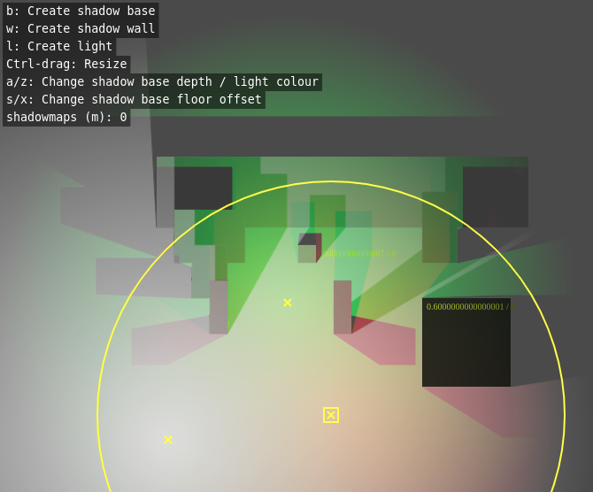

# 2.5d lighting & shadow volumes test

> This has been deprecated! It's got so many broken edge cases that it's pretty much unusable...
> I have implemented a better method here: https://github.com/basementuniverse/lighting-2d

An experiment in rendering 2.5d shadow volumes.

Instructions:
* ShadowBases are 'ground profiles' for objects in the world. These cast shadows on the ground and on walls. Press 'b' to create a ShadowBase.
* ShadowWalls are vertical surfaces facing down, ie. facing the camera. These receive shadows. Press 'w' to create a ShadowWall.
* Lights cast coloured light. Press 'l' to create a Light.
* Shadow bases and walls can be dragged around and resized (Ctrl & drag).
* 'a' / 'z' to raise or lower the height of a ShadowBase while hovering over it.
* 's' / 'x' to raise or lower the floor offset (height above the ground) of a ShadowBase while hovering over it.
* Lights can also be dragged around and their radius resized (Ctrl & drag from center).
* 'a' / 'z' to cycle through Light colours while hovering over a Light.
* 'm' to toggle Light shadowmaps - this will toggle between 'hide', 'floor shadow map' and 'wall shadow map'.
* Call `save()` (in the devtools console) to save state into local storage.
* Call `load()` to load state from local storage.

Eventual plans:

* Use three.js or some other WebGL library so we can use shaders...
* Each light has a radial gradient for brightness - when inverted, this can be used as a 'blur map' in a gaussian blur shader to make blurry shadows (more blur further away from the light source).
* Each light could have a normal map (precomputed and stored as a texture), when compared per-pixel to a ShadowWall normal map can be used for detailed surface lighting.

Feel free to modify and use this anywhere. If you find it useful or if you use it in one of your own projects, I'd love to hear about it!

Enjoy :)
